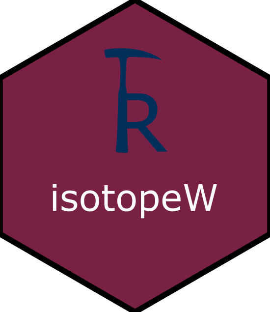

# IsotopeW 
The computer program reduce W isotopic data from Neptune analysis. Runs as shiny app.

## Installation

As this package is not currently on CRAN, install it via devtools:

```r
devtools::install_github("TheRFrog/IsotopeW")
```
## Access Apps

- from the package (see below)

```r
#entry level app
library(IsotopeW)
#run the app
IsotopeW()


## **Contact** 

[Dr. Reneé González Guzmán] (mailto:rguzman@geociencias.unam.mx)

## Templates

Four template files (.csv format) can be downloaded at: 
https://github.com/TheRFrog/IsotopeW/tree/main/inst/extdata
